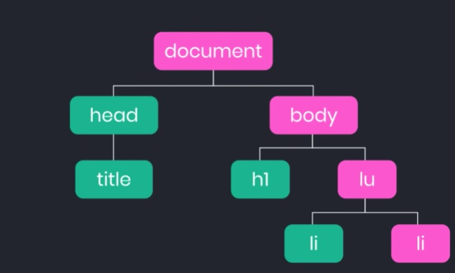

# Propagación de Eventos en JavaScript

## ¿Qué son los eventos?

Empecemos por lo fundamental. Los eventos os objetos que implementan 

la interfaz Event definida dentro del estándar del DOM.

Este tipo de objetos son enviados tanto por el user agent (a menudo el

navegador) o por la propia aplicación y son recibidos y procesados por

los Event Listeners. Su principal función es permitir responder a las 

interacciones de los usuarios o cambios en la red.

## ¿Como se propagan los eventos?

Los eventos en javascript no se detienen en el elemento que los disparo 

sino que se propagan. La propagación se hará a todos los ancestros hasta 

llegar al último nodo padre, es decir, de forma ascendente a la propagación 

de eventos de forma ascendente lo vamos a conocer como even bullying o evento 

burbuja ya que este comportamiento simula burbujas ascendiendo a la superficie 

veamos un ejemplo.

Si un usuario hace clic sobre nuestro elemento el elemento  li llegará a dicho 

elemento inmediatamente después el evento se propagara a su padre, es decir, 

el elemento lu es como si el usuario también hubiese dado clic a este elemento 

posteriormente el evento se propagara a todos los padres hasta llegar al último

elemento de nuestro árbol.

*César Castro Salazar

*Num. Control: 18100157